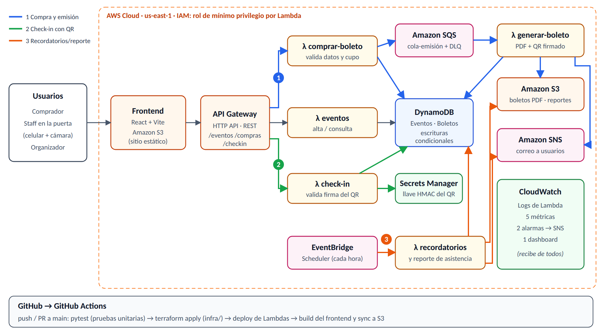

# PaseQR — Boletos digitales con QR en la nube

Proyecto Integrador · Desarrollo en la Nube · Otoño 2026 · ITESO (Prof. Marcela Rosales)

**PaseQR** es una plataforma serverless en AWS para que organizadores de eventos pequeños y medianos (conciertos universitarios, conferencias, torneos, fiestas) vendan o registren boletos, los entreguen como **PDF con código QR firmado** y validen la entrada en la puerta desde cualquier celular, sin sobreventa ni boletos duplicados.

## Problema

Muchos eventos se organizan con hojas de cálculo, transferencias y listas impresas. Eso provoca sobreventa, boletos falsificados o reutilizados (una captura de pantalla se puede compartir), filas lentas en la entrada y cero datos de asistencia al final. La demanda llega en picos (apertura de preventa, hora de entrada) y el resto del tiempo es casi nula, por eso una arquitectura serverless en la nube es la opción adecuada.

## Flujos end-to-end

| # | Flujo | Resultado observable |
|---|-------|----------------------|
| 1 | **Compra y emisión de boleto**: validación de datos y cupo → escritura condicional en DynamoDB → cola SQS → Lambda genera PDF con QR | Boleto PDF en S3 (descarga con URL prefirmada) + correo vía SNS |
| 2 | **Check-in con QR**: el staff escanea el QR → se valida la firma HMAC, el evento y que no se haya usado | Boleto marcado como `USADO` y contador de asistencia en vivo |
| 3 | **Recordatorios y reporte de asistencia**: EventBridge ejecuta un Lambda programado | Recordatorio 24 h antes por SNS y reporte CSV de asistencia en S3 para el organizador |

## Arquitectura



**Servicios de AWS:** Lambda, API Gateway, DynamoDB, S3, SQS, SNS y CloudWatch (más IAM, Secrets Manager y EventBridge).

**Stack:** frontend React + Vite (sitio estático en S3) · backend Python 3.12 en Lambda · infraestructura con Terraform · CI/CD con GitHub Actions (pruebas con pytest) · monitoreo con CloudWatch (5 métricas, 2 alarmas, 1 dashboard).

## Equipo

| Integrante | Rol |
|------------|-----|
| David Valdez | Flujo 1 (compra y emisión) + Frontend |
| Vittorio Catino | Flujo 2 (check-in con QR) + CI/CD |
| Juan Pablo Gutiérrez | Flujo 3 (recordatorios y reporte) + Monitoreo |

## Estructura del repositorio

```
backend/
  src/paseqr/common/     # utilidades compartidas: respuestas HTTP, validación, DynamoDB
  src/paseqr/handlers/   # una Lambda por archivo (eventos, compras, generar_boleto, checkin, recordatorios)
  tests/                 # pruebas unitarias con pytest + moto (AWS simulado)
frontend/                # React + Vite, se publica como sitio estático en S3
infra/                   # Terraform: DynamoDB, S3, SQS, SNS, Secrets Manager, Lambda, API Gateway, EventBridge
scripts/                 # bootstrap, build y deploy
.github/workflows/       # CI (pruebas, build, terraform validate) y deploy a AWS
docs/                    # diagramas y reportes
```

## Estado actual (Fase 2)

| Componente | Estado | Responsable |
|------------|--------|-------------|
| Infraestructura base (Terraform) | Lista | Equipo |
| API `GET/POST /eventos` + página para crear y listar eventos | Lista | Equipo |
| Flujo 1 — `POST /compras`, cola SQS, PDF con QR, "Mis boletos" | Pendiente (responde 501) | David |
| Flujo 2 — `POST /checkin`, firma HMAC, escáner QR | Pendiente (responde 501) | Vittorio |
| Flujo 3 — recordatorios y reporte CSV | Pendiente (Lambda programada sin lógica) | Juan Pablo |
| CI/CD con GitHub Actions | Pruebas y build listos; deploy requiere los secrets de AWS | Vittorio |
| Monitoreo (5 métricas, 2 alarmas, dashboard) | Pendiente (Fase 3) | Juan Pablo |

Los archivos pendientes tienen en su docstring el contrato de entrada/salida y los pasos a implementar.

## Cómo desplegar

### Requisitos

- Cuenta de **AWS Academy (Learner Lab)** iniciada. Las Lambdas usan el rol existente `LabRole`, porque en Academy no se pueden crear roles.
- `aws` CLI, Terraform ≥ 1.10, Python 3.12 y Node 20.

### Desde tu computadora

1. En el Learner Lab: **Start Lab → AWS Details → AWS CLI → Show** y copia el contenido a `~/.aws/credentials`. Estas credenciales vencen cada ~4 horas.
2. Ejecuta:

```bash
./scripts/deploy.sh            # crea el bucket de estado, empaqueta, aplica Terraform y sube el frontend
```

Al final se imprimen la URL de la API y la del sitio. Para borrar todo: `./scripts/destroy.sh`.

El estado de Terraform se guarda en S3 (`paseqr-tfstate-<cuenta>`), así que GitHub Actions y los tres integrantes comparten la misma infraestructura.

### Con GitHub Actions

- **CI** (`ci.yml`): en cada Pull Request y en cada push a una rama corre pytest, el build del frontend y `terraform fmt`/`validate`.
- **Deploy** (`deploy.yml`): en cada push a `main` corre las pruebas y ejecuta `scripts/deploy.sh`.

Al iniciar el Learner Lab hay que actualizar en **Settings → Secrets and variables → Actions** los secrets `AWS_ACCESS_KEY_ID`, `AWS_SECRET_ACCESS_KEY` y `AWS_SESSION_TOKEN`, porque cambian en cada sesión.

### Desarrollo local

```bash
cd backend && pip install -r requirements-dev.txt && pytest      # pruebas
cd frontend && npm install && cp .env.example .env && npm run dev  # frontend contra la API desplegada
```

## Forma de trabajo

1. Crea una rama por tarea: `git checkout -b flujo1/compra`.
2. Haz commits pequeños y abre un Pull Request hacia `main`.
3. CI tiene que pasar y otro integrante revisa antes de hacer merge.
4. El merge a `main` despliega automáticamente.
